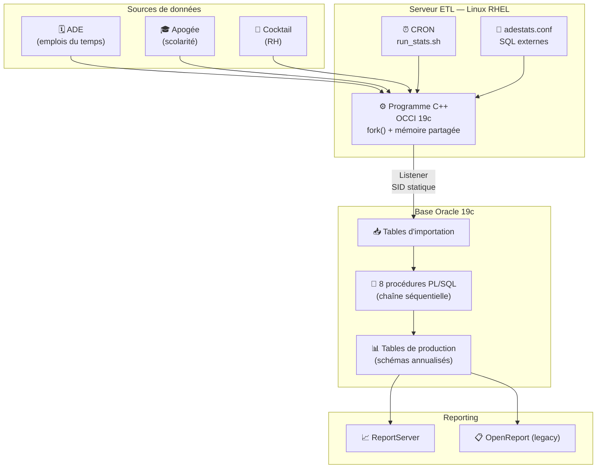

# ADESTATS — Documentation d'un pipeline ETL universitaire

## Contexte

**ADESTATS** est un pipeline de statistiques d'enseignement pour un établissement d'enseignement supérieur (~15 000 étudiants, ~90 000 événements planifiés/an). Il extrait les données de planification (emplois du temps), les croise avec les référentiels de scolarité et de ressources humaines, puis alimente des tableaux de bord pour le pilotage des charges d'enseignement.

**Criticité :** ce pipeline alimente directement les rapports utilisés par le Pilotage institutionnel et les composantes pour le suivi des heures d'enseignement (CM, TD, TP), les taux d'occupation des salles, et la ventilation des charges par enseignant. Un arrêt de production impacte la Direction du Pilotage (reporting institutionnel) et les composantes (suivi des services enseignants).

J'ai repris la maintenance complète de ce système (code C++, PL/SQL, serveur Oracle, exploitation) **sans aucune documentation existante**. Ce dépôt rassemble la documentation que j'ai construite par rétro-ingénierie, ainsi que des exemples de code anonymisés.

---

## Architecture



---

## Chaîne de traitement PL/SQL

Le pipeline PL/SQL s'exécute en 8 étapes séquentielles, orchestrées par une procédure maître. Chaque étape est journalisée dans une table de logs.


| Étape | Procédure | Rôle |
|---|---|---|
| 1 | `PROC_001` | Purge des tables de travail (_W), désactivation/réactivation des contraintes FK |
| 2 | `PROC_002` | Ventilation des données extraites → activités, enseignants, groupes, salles |
| 3 | `PROC_003` | Enrichissement : effectifs groupes, comptage enseignants, codes ABYLA (salles) |
| 4 | `PROC_004` | Agrégation des heures par type (CM, TD, TP, CI, CONF, PROJET) |
| 5 | `PROC_005` | Construction des codes étape : comptage, effectifs, listes (LISTAGG) |
| 6 | `PROC_006` | Croisement RH (corps, contrat), coefficients équivalent TD (CM×1.5, TD×1.0, TP÷1.5) |
| 7 | `PROC_007` | Assemblage rapport dénormalisé : salles, codes ABYLA, effectifs ventilés |
| 8 | `PROC_008` | Bascule tables de travail (_W) → tables de production |

---

## Contenu du dépôt

```
adestats-documentation/
├── README.md                          ← Ce fichier
├── snippet_occi_fork.cpp             ← Extrait C++ : connexion OCCI, fork(), mémoire partagée
├── architecture/
│   ├── composants.md                  ← VMs, Oracle, schémas, flux
│   ├── programme-cpp.md               ← Programme C++ ETL (OCCI, fork, mémoire partagée)
│   └── chaine-traitement.md           ← Détail des 8 procédures PL/SQL
├── diagrammes/
│   └── architecture.md                ← Diagrammes Mermaid (flux, chaîne, schémas)
├── incidents/
│   ├── ora-12516-occi.md              ← Post-mortem : conflit librairies 19c/21c
│   └── ora-12899-varchar.md           ← Post-mortem : désalignement VARCHAR2 BYTE vs CHAR
├── plsql/                             ← Extraits PL/SQL anonymisés (à compléter)
├── exploitation/                      ← Procédures d'exploitation (à compléter)
└── vues/                              ← Vues de reporting (à compléter)
```

---

## Points techniques notables

**Programme C++ avec multi-processus** — Le binaire ETL utilise `fork()` pour séparer l'extraction (processus enfant) de l'affichage de progression (processus parent), avec communication par mémoire partagée (`shmget`/`shmat`). Un verrouillage par `flock` empêche les exécutions concurrentes. Voir le [snippet C++ anonymisé](snippet_occi_fork.cpp) et la [documentation détaillée](architecture/programme-cpp.md).

**Reprise sans documentation** — Le système a été développé par un prédécesseur, sans documentation technique ni fonctionnelle. J'ai reconstruit la compréhension du système par rétro-ingénierie du code C++ et PL/SQL, et créé l'intégralité de la documentation présente dans ce dépôt.

**Pipeline à 8 étapes avec pattern "tables de travail"** — Les procédures utilisent un pattern classique d'ETL : extraction dans des tables suffixées `_W` (work), transformation en place, puis bascule vers les tables de production. Les contraintes FK sont désactivées pendant le traitement pour la performance.

**Croisement de 3 sources hétérogènes** — Le programme C++ (OCCI) effectue des jointures entre les emplois du temps (ADE), la scolarité (Apogée) et les ressources humaines (Cocktail) via des DB links Oracle.

**Correction de bugs hérités** — Plusieurs corrections documentées : logique de ventilation des `IS_COURSEMEMBER` (MERGE défaillant sur les cas limites), découpage nom/prénom par REGEX, désalignement VARCHAR2 BYTE vs CHAR.

**Schémas annualisés** — Chaque année universitaire dispose de son propre schéma Oracle (`ADESTATS_06`, `_07`...) avec ses procédures et tables. Un schéma commun contient le référentiel des projets.

---

## Volumétrie

| Indicateur | Valeur |
|---|---|
| Étudiants dans le périmètre | ~15 000 |
| Événements planifiés / an | ~90 000 |
| Enseignants croisés avec la RH | ~1 500 |
| Salles référencées | ~466 |
| Tables de production | 12 |
| Fréquence d'exécution | Quotidienne (J+1) |

---

## Contexte de maintenance

Ce système est en **production quotidienne** et utilisé pour le pilotage des charges d'enseignement. La maintenance couvre :
- Le code PL/SQL (corrections, évolutions fonctionnelles)
- Le binaire C++ (compilation OCCI 19c, dépendances)
- Le serveur Oracle 19c (listener, redo logs, dimensionnement)
- Le système d'exploitation (RHEL, cron, ulimit, SELinux)
- L'intégration avec les outils de reporting (ReportServer, OpenReport)
