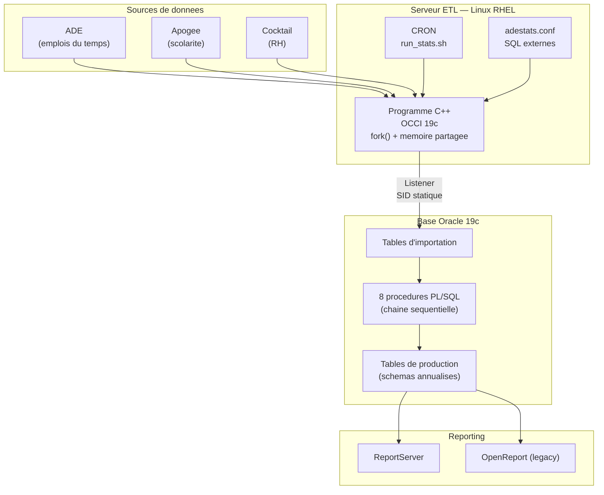
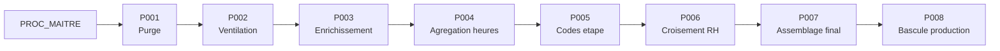

# ADESTATS — Documentation d'un pipeline ETL universitaire

## Contexte

**ADESTATS** est un pipeline de statistiques d'enseignement conçu pour un établissement d'enseignement supérieur d'environ 15 000 étudiants et 90 000 événements planifiés par an. Il assure l'extraction des données de planification, leur croisement avec les référentiels de scolarité (Apogée) et de ressources humaines (Cocktail), afin d'alimenter les tableaux de bord décisionnels.

**Criticité :** ce pipeline est vital pour le Pilotage institutionnel. Il permet :

* Le suivi des heures d'enseignement (CM, TD, TP).
* L'analyse des taux d'occupation des salles.
* La ventilation des charges par enseignant.
* **La génération des rapports pour le calcul des fiches de paye des vacataires et des enseignants**.

Un arrêt de production impacte directement la Direction du Pilotage et les composantes de l'université.

Reprise de la maintenance complète dans un contexte de documentation technique lacunaire, ce système a fait l'objet d'un audit approfondi. Ce dépôt centralise l'effort de rétro-ingénierie réalisé pour documenter le fonctionnement interne (C++ / PL/SQL) et assurer la traçabilité des correctifs appliqués.

---

## Architecture

Le système s'appuie sur une infrastructure distribuée dont les détails (VMs, instances Oracle, flux réseaux) sont inventoriés dans le document des **[composants système](https://www.google.com/search?q=architecture/composants.md)**. Les **[diagrammes d'architecture](https://www.google.com/search?q=diagrammes/architecture.md)** au format Mermaid détaillent visuellement ces interactions.

---

## Chaîne de traitement PL/SQL

Le traitement est orchestré par une procédure maître qui appelle 8 étapes séquentielles. Chaque étape est journalisée dans une table de logs dédiée. Vous trouverez la spécification technique complète de ces procédures dans la **[documentation de la chaîne de traitement](https://www.google.com/search?q=architecture/chaine-traitement.md)**.

| Étape | Procédure | Rôle |
| --- | --- | --- |
| **1** | `PROC_001` | Purge des tables de travail (_W) et gestion des contraintes FK pour la performance. |
| **2** | `PROC_002` | Ventilation des données brutes vers les entités : activités, enseignants, groupes et salles. |
| **3** | `PROC_003` | Enrichissement : calcul des effectifs groupes et mapping des codes salles ABYLA. |
| **4** | `PROC_004` | Agrégation des volumes horaires par type (CM, TD, TP, CI, CONF, PROJET). |
| **5** | `PROC_005` | Construction des codes étape : calcul des effectifs et listage (LISTAGG). |
| **6** | `PROC_006` | Croisement RH (corps, contrat) et application des coefficients équivalent TD (CM x 1.5, TD x 1.0, TP / 1.5). |
| **7** | `PROC_007` | Assemblage du rapport dénormalisé final intégrant salles, codes ABYLA et effectifs ventilés. |
| **8** | `PROC_008` | Bascule finale des tables de travail (_W) vers les tables de production. |

---

## Points techniques notables

* **Multi-processus C++** : Le binaire utilise fork pour séparer l'extraction de l'affichage de progression. Le fonctionnement interne de l'ETL (OCCI, mémoire partagée, flock) est décrit dans le fichier **[programme-cpp.md](https://www.google.com/search?q=architecture/programme-cpp.md)** et illustré par ce **[snippet de code OCCI](https://www.google.com/search?q=snippet_occi_fork.cpp)**.
* **Rétro-ingénierie** : Reconstitution complète de la logique système (C++ et PL/SQL) en partant de zéro documentation.
* **Maintenance évolutive et Incidents** : Plusieurs anomalies critiques ont été identifiées et résolues, notamment :
* Le conflit de librairies Oracle 19c/21c (**[Post-mortem ORA-12516](https://www.google.com/search?q=incidents/ora-12516-occi.md)**).
* Le désalignement des types VARCHAR2 BYTE vs CHAR (**[Post-mortem ORA-12899](https://www.google.com/search?q=incidents/ora-12899-varchar.md)**).

* **Annualisation** : Gestion de 7 schémas Oracle annuels (ADESTATS_01 à _07) pour l'historisation des données.

---

## Volumétrie annuelle

| Indicateur | Valeur |
| --- | --- |
| **Étudiants** | Environ 15 000 |
| **Événements planifiés** | Environ 90 000 |
| **Enseignants (RH)** | Environ 1 500 |
| **Salles référencées** | 466 |
| **Production** | 12 tables par schéma annuel |
| **Fréquence** | Quotidienne (J+1) |

---

## Contexte de maintenance

Ce système est en **production quotidienne** et utilisé pour le pilotage et les scolarités. La maintenance couvre :

* Le code PL/SQL (corrections, évolutions fonctionnelles).
* Le binaire C++.
* Le serveur Oracle 19c (listener, redo logs, dimensionnement).
* Le système d'exploitation RHEL.
* L'intégration avec les outils de reporting (ReportServer, OpenReport).
