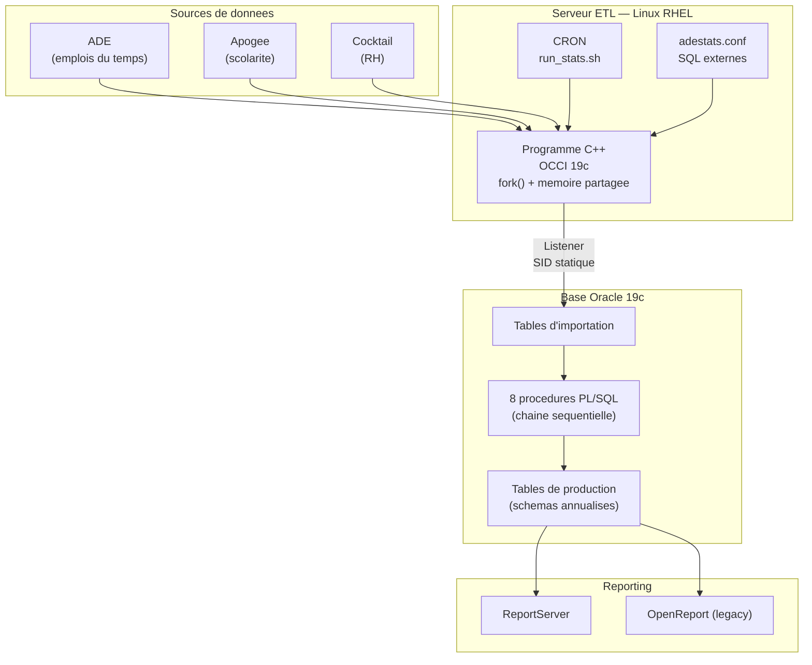
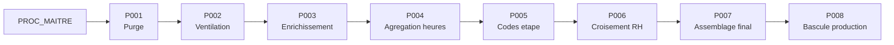

# ADESTATS — Documentation d'un pipeline ETL universitaire

## Contexte

**ADESTATS** est un pipeline de statistiques d'enseignement conçu pour un établissement d'enseignement supérieur gérant environ **15 000 étudiants** et **90 000 événements planifiés** par an. Il assure l'extraction des données de planification (emplois du temps), leur croisement avec les référentiels de scolarité (Apogée) et de ressources humaines (Cocktail), afin d'alimenter les tableaux de bord décisionnels.

**Criticité :** ce pipeline est vital pour le Pilotage institutionnel. Il permet :

* Le suivi des heures d'enseignement (CM, TD, TP).
* L'analyse des taux d'occupation des salles.
* La ventilation des charges par enseignant.
* **La génération des rapports pour le calcul des fiches de paye des vacataires et des enseignants**.

Un arrêt de production impacte directement la Direction du Pilotage et les composantes de l'université.

J'ai repris la maintenance complète de ce système (code C++, PL/SQL, serveur Oracle, exploitation) alors qu'**aucune documentation n'existait**. Ce dépôt est le fruit d'un travail de rétro-ingénierie visant à documenter le fonctionnement interne et les correctifs apportés.

---

## Architecture

---

## Chaîne de traitement PL/SQL

Le traitement est orchestré par une procédure maître qui appelle 8 étapes séquentielles. Chaque étape est journalisée dans une table de logs dédiée.

| Étape | Procédure | Rôle |
| --- | --- | --- |
| **1** | `PROC_001` | Purge des tables de travail (_W) et gestion des contraintes FK pour la performance. |
| **2** | `PROC_002` | Ventilation des données brutes vers les entités : activités, enseignants, groupes et salles. |
| **3** | `PROC_003` | Enrichissement : calcul des effectifs groupes et mapping des codes salles ABYLA. |
| **4** | `PROC_004` | Agrégation des volumes horaires par type (CM, TD, TP, CI, CONF, PROJET). |
| **5** | `PROC_005` | Construction des codes étape : calcul des effectifs et listage (LISTAGG). |
| **6** | `PROC_006` | Croisement RH (corps, contrat) et application des coefficients équivalent TD (CM×1.5, TD×1.0, TP÷1.5). |
| **7** | `PROC_007` | Assemblage du rapport dénormalisé final intégrant salles, codes ABYLA et effectifs ventilés. |
| **8** | `PROC_008` | Bascule finale des tables de travail (_W) vers les tables de production. |

---

## Contenu du dépôt

* **README.md** : Documentation globale du pipeline.
* **snippet_occi_fork.cpp** : Extrait du code C++ (connexion OCCI, `fork()`, mémoire partagée).
* **architecture/** : Détails sur les VMs, les schémas Oracle et le binaire C++.
* **diagrammes/** : Sources des diagrammes Mermaid (flux, chaîne de traitement).
* **incidents/** : Post-mortems (erreurs OCCI ORA-12516, problèmes de VARCHAR2 BYTE vs CHAR ORA-12899).
* **plsql/** : Procédures PL/SQL anonymisées.
* **exploitation/** : Scripts de lancement (cron, Shell) et fichiers de configuration.
* **vues/** : Définitions des vues SQL pour la couche de reporting.

---

## Points techniques notables

* **Multi-processus C++** : Utilisation de `fork()` pour séparer l'extraction de l'affichage de progression. La communication est gérée via des segments de mémoire partagée (`shmget`/`shmat`) et la concurrence par `flock`.
* **Rétro-ingénierie** : Reconstitution complète de la logique système (C++ et PL/SQL) en partant de zéro documentation.
* **Pattern "Tables de travail"** : Utilisation de tables intermédiaires `_W` permettant de sécuriser les transformations avant la bascule en production.
* **Jointures hétérogènes** : Croisement de 3 sources distinctes (ADE, Apogée, Cocktail) via DB links.
* **Maintenance évolutive** : Correction de bugs hérités sur la ventilation (`IS_COURSEMEMBER`), optimisation via REGEX et alignement des types Oracle.
* **Annualisation** : Gestion de 7 schémas Oracle annuels (`ADESTATS_01` à `_07`) pour l'historisation des données.

---

## Volumétrie annuelle

| Indicateur | Valeur |
| --- | --- |
| **Étudiants** | ~15 000 |
| **Événements planifiés** | ~90 000 |
| **Enseignants (RH)** | ~1 500 |
| **Salles référencées** | 466 |
| **Production** | 12 tables par schéma annuel |
| **Fréquence** | Quotidienne (J+1) |

---

## Maintenance du système

La maintenance est multi-couches :

1. **Code PL/SQL** : Évolutions fonctionnelles et corrections de bugs de calcul.
2. **Binaire C++** : Compilation avec OCCI 19c et gestion des dépendances.
3. **Infrastructure Oracle** : Surveillance du listener, des redo logs et du dimensionnement.
4. **OS Linux** : Gestion des tâches cron, des limites système (ulimit) et de SELinux.
5. **Reporting** : Maintien des états sous ReportServer et du legacy OpenReport.
