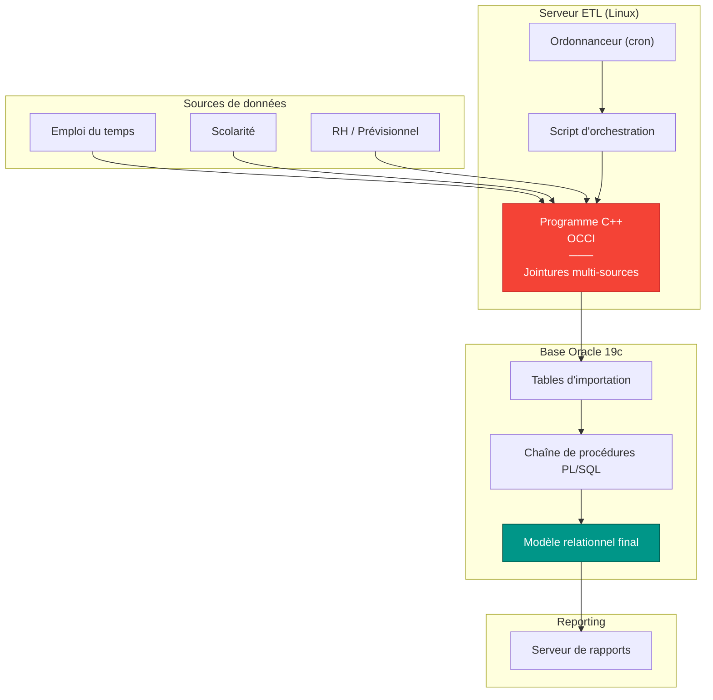

# ADESTATS — Pipeline ETL de statistiques d'enseignement

Pipeline de statistiques d'enseignement pour un établissement d'enseignement supérieur.
Extraction de données de planification, croisement avec des référentiels de scolarité et de ressources humaines, alimentation de tableaux de bord décisionnels pour le pilotage institutionnel. Le système sert aussi de base aux états de paiement des heures des enseignants et vacataires.

> **Mon rôle.** Ce système a été développé par un prédécesseur, sans documentation technique ni fonctionnelle. Je l'ai repris par rétro-ingénierie du code C++ et PL/SQL, j'en assure le maintien en conditions opérationnelles, et j'ai rédigé l'intégralité de la documentation présentée ici.

---

## Architecture

Le système repose sur trois sources de données, un programme C++ d'extraction (OCCI / fork / mémoire partagée), une base Oracle 19c avec une chaîne de procédures PL/SQL séquentielles, et une couche de reporting.


```mermaid
graph TD
    subgraph SOURCES["Sources de données"]
        ADE["Emploi du temps"]
        APO["Scolarité"]
        CKT["RH / Prévisionnel"]
    end

    subgraph ETL["Serveur ETL (Linux)"]
        CRON["Ordonnanceur (cron)"]
        WRAP["Script d'orchestration"]
        CPP["Programme C++<br/>OCCI<br/>───<br/>Jointures multi-sources"]
    end

    subgraph ORACLE["Base Oracle 19c"]
        IMPORT["Tables d'importation"]
        PLSQL["Chaîne de procédures PL/SQL"]
        MODEL["Modèle relationnel final"]
    end

    subgraph REPORT["Reporting"]
        RS["Serveur de rapports"]
    end

    ADE --> CPP
    APO --> CPP
    CKT --> CPP

    CRON --> WRAP
    WRAP --> CPP

    CPP --> IMPORT
    IMPORT --> PLSQL
    PLSQL --> MODEL

    MODEL --> RS

    style CPP fill:#F44336,stroke:#C62828,color:#fff
    style MODEL fill:#009688,stroke:#004D40,color:#fff
```

---

## Chaîne de traitement PL/SQL

Le traitement est orchestré par une procédure maître qui appelle une séquence d'étapes, chacune journalisée dans une table de logs dédiée.


```mermaid
graph LR
    M["Procédure maître<br/>Orchestrateur"]
    P1["Purge des tables<br/>de travail"]
    P2["Ventilation des<br/>données brutes"]
    P3["Enrichissement"]
    P4["Agrégation des<br/>volumes horaires"]
    P5["Construction des<br/>codes étape"]
    P6["Croisement RH"]
    P7["Assemblage du<br/>rapport final"]
    P8["Bascule en<br/>production"]

    M --> P1 --> P2 --> P3 --> P4 --> P5 --> P6 --> P7 --> P8

    style M fill:#FF9800,stroke:#E65100,color:#fff
    style P8 fill:#009688,stroke:#004D40,color:#fff
```

| Étape | Rôle |
| ----- | ---- |
| 1 | Purge des tables de travail et gestion des contraintes d'intégrité |
| 2 | Ventilation des données brutes : activités, enseignants, groupes, salles |
| 3 | Enrichissement : effectifs de groupes, mapping des salles |
| 4 | Agrégation des volumes horaires par type d'activité (CM, TD, TP, etc.) |
| 5 | Construction des codes étape (effectifs et listage) |
| 6 | Croisement avec les données RH (corps, contrat, coefficients d'équivalence) |
| 7 | Assemblage du rapport dénormalisé final |
| 8 | Bascule des tables de travail vers les tables de production |

---

## Schémas annualisés

Les données sont historisées dans des schémas Oracle annuels, avec un schéma commun portant les tables de référence partagées. Chaque schéma annuel est créé selon une procédure documentée, garantissant la reproductibilité d'une année sur l'autre.

---

## Points techniques notables

- **Multi-processus C++** — usage de `fork()` pour séparer extraction et suivi de progression, communication inter-processus via mémoire partagée (`shmget`/`shmat`), gestion de la concurrence via verrouillage de fichier (`flock`).
- **Pattern tables de travail** — tables intermédiaires dédiées, sécurisant les transformations avant bascule en production (garantit qu'un traitement interrompu n'impacte jamais les données déjà en production).
- **Jointures hétérogènes** — croisement de plusieurs sources distinctes via liens de base de données Oracle (DB links).
- **Robustesse** — gestion des cas limites d'encodage et de typage sur des données multi-sources hétérogènes.

---

## Reprise et maintenance

**Rétro-ingénierie** — Reconstitution du fonctionnement complet du système à partir du code source (programme C++, chaîne PL/SQL, scripts d'exploitation), en l'absence de toute documentation.

**Correction de défauts hérités** — Plusieurs anomalies corrigées, dont :

- une logique de filtrage qui excluait les salles banalisées du reporting, écartant jusqu'à **2 500 heures d'enseignement par an** des indicateurs d'occupation des salles ;
- un désalignement de tailles de colonnes (`VARCHAR2` en `BYTE` contre `CHAR`) qui bloquait la chaîne de calcul dès qu'un libellé d'activité dépassait 200 caractères, invisible jusqu'au premier cas réel ;
- le découpage des noms et prénoms, réécrit par expressions régulières.

**Audits de fiabilité** — Réponses aux questions des gestionnaires, démontrées par croisement des tables de production avec les données brutes de planification. Exemple : vérifier qu'une séance planifiée sans salle est bien comptabilisée dans le service d'un enseignant, preuve établie sur trois années universitaires.

**Bascule annuelle** — Création du schéma de l'année suivante par export et import de structure (Oracle Data Pump), recréation des contraintes et vérifications, selon une procédure documentée.

---

## Contenu du dépôt

```
├── architecture/
│   ├── chaine-traitement.md    # Détail de la chaîne de procédures PL/SQL
│   ├── composants.md           # Composants techniques (schémas Oracle, binaire C++)
│   └── programme-cpp.md        # Connexion OCCI, fork, mémoire partagée
├── plsql/                      # Procédures PL/SQL anonymisées
├── exploitation/               # Scripts cron, shell, configuration (génériques)
├── vues/                       # Vues SQL pour la couche reporting
└── snippet_occi_fork.cpp       # Extrait C++ (OCCI + fork + mémoire partagée)
```

---

## Contexte

Ce pipeline est en production quotidienne au sein d'un établissement d'enseignement supérieur. J'en assure la maintenance, qui couvre le code PL/SQL, le binaire C++, le serveur Oracle, l'infrastructure Linux et l'intégration avec la couche de reporting.

Ce dépôt documente le fonctionnement technique du système à des fins de démonstration de compétences (ETL, C++, PL/SQL, administration Linux) — il ne reflète pas nécessairement la configuration ou les données réelles de production.
