# ADESTATS — Pipeline ETL de statistiques d'enseignement

Pipeline de statistiques d'enseignement pour un établissement d'enseignement supérieur (~15 000 étudiants, ~90 000 événements/an).  
Extraction des données de planification, croisement avec les référentiels de scolarité (Apogée) et de ressources humaines (Cocktail), alimentation des tableaux de bord décisionnels.

**Criticité :** ce pipeline est vital pour le pilotage institutionnel :

- Suivi des heures d'enseignement (CM, TD, TP)
- Analyse des taux d'occupation des salles
- Ventilation des charges par enseignant
- **Génération des rapports pour le calcul des fiches de paye des vacataires et des enseignants**

> Un arrêt de production impacte directement la Direction du Pilotage et les composantes de l'université.

---

## Architecture

Le système repose sur trois sources de données, un programme C++ d'extraction (OCCI / fork / mémoire partagée), une base Oracle 19c avec 8 procédures PL/SQL séquentielles, et une couche de reporting.


> Détails : [Composants techniques](architecture/composants.md) · [Programme C++](architecture/programme-cpp.md)

---

## Chaîne de traitement PL/SQL

Le traitement est orchestré par une procédure maître qui appelle 8 étapes séquentielles. Chaque étape est journalisée dans une table de logs dédiée.

```mermaid
graph LR
    M["<b>PROC_MAITRE</b><br/>Orchestrateur"]
    P1["P001<br/>Purge _W"]
    P2["P002<br/>Ventilation"]
    P3["P003<br/>Enrichissement"]
    P4["P004<br/>Agrégation<br/>heures"]
    P5["P005<br/>Codes étape"]
    P6["P006<br/>Croisement RH"]
    P7["P007<br/>Assemblage<br/>rapport"]
    P8["P008<br/>Bascule<br/>production"]

    M --> P1 --> P2 --> P3 --> P4 --> P5 --> P6 --> P7 --> P8

    style M fill:#FF9800,stroke:#E65100,color:#fff
    style P8 fill:#009688,stroke:#004D40,color:#fff
```



| Étape | Procédure | Rôle |
|:-----:|-----------|------|
| 1 | `PROC_001` | Purge des tables de travail (_W) et gestion des contraintes FK |
| 2 | `PROC_002` | Ventilation des données brutes : activités, enseignants, groupes, salles |
| 3 | `PROC_003` | Enrichissement : effectifs groupes, mapping codes salles ABYLA |
| 4 | `PROC_004` | Agrégation des volumes horaires par type (CM, TD, TP, CI, CONF, PROJET) |
| 5 | `PROC_005` | Construction des codes étape : effectifs et listage (LISTAGG) |
| 6 | `PROC_006` | Croisement RH (corps, contrat), coefficients équivalent TD (CM×1.5, TD×1.0, TP÷1.5) |
| 7 | `PROC_007` | Assemblage du rapport dénormalisé final (salles, ABYLA, effectifs ventilés) |
| 8 | `PROC_008` | Bascule tables de travail (_W) → tables de production |

> Détails : [Chaîne de traitement](architecture/chaine-traitement.md) · [Procédures PL/SQL](plsql/)

---

## Schémas annualisés

Les données sont historisées dans des schémas Oracle annuels. Un schéma commun porte les tables de référence partagées.


Chaque schéma annuel contient **12 tables de production**. La création d'un nouveau schéma suit la procédure documentée dans [exploitation](exploitation/).

---

## Volumétrie

| Indicateur | Valeur |
|------------|--------|
| Étudiants | ~15 000 |
| Événements planifiés | ~90 000 |
| Enseignants (RH) | ~1 500 |
| Salles référencées | 466 |
| Tables par schéma annuel | 12 |
| Fréquence d'exécution | Quotidienne (J+1) |

---

## Points techniques notables

- **Multi-processus C++** — `fork()` pour séparer extraction et affichage de progression, communication via mémoire partagée (`shmget`/`shmat`), concurrence via `flock`. Voir [programme-cpp.md](architecture/programme-cpp.md).
- **Pattern tables de travail** — Tables intermédiaires `_W` sécurisant les transformations avant bascule en production.
- **Jointures hétérogènes** — Croisement de 3 sources distinctes (ADE, Apogée, Cocktail) via DB links Oracle.
- **Corrections héritées** — Ventilation `IS_COURSEMEMBER`, optimisation REGEX, alignement types Oracle (BYTE vs CHAR).

---

## Incidents documentés

| Incident | Description |
|----------|-------------|
| [ORA-12516](incidents/ora-12516-occi.md) | Saturation du listener — trop de sessions OCCI simultanées |
| [ORA-12899](incidents/ora-12899-varchar.md) | Troncature VARCHAR2 — BYTE vs CHAR sur colonnes multi-octets |

---

## Contenu du dépôt

```
├── architecture/
│   ├── chaine-traitement.md    # Détail des 8 procédures PL/SQL
│   ├── composants.md           # VMs, schémas Oracle, binaire C++
│   └── programme-cpp.md        # Connexion OCCI, fork, mémoire partagée
├── incidents/
│   ├── ora-12516-occi.md       # Post-mortem saturation listener
│   └── ora-12899-varchar.md    # Post-mortem BYTE vs CHAR
├── plsql/                      # Procédures PL/SQL anonymisées
├── exploitation/               # Scripts cron, shell, configuration
├── vues/                       # Vues SQL pour la couche reporting
└── snippet_occi_fork.cpp       # Extrait C++ (OCCI + fork + shm)
```

---

## Contexte de maintenance

Ce système est en **production quotidienne**. La maintenance couvre le code PL/SQL, le binaire C++, le serveur Oracle 19c (listener, redo logs, dimensionnement), le système RHEL et l'intégration reporting (ReportServer, OpenReport).

Reprise de maintenance dans un contexte de documentation technique lacunaire — ce dépôt centralise l'effort de rétro-ingénierie réalisé pour documenter le fonctionnement interne et assurer la traçabilité des correctifs.
