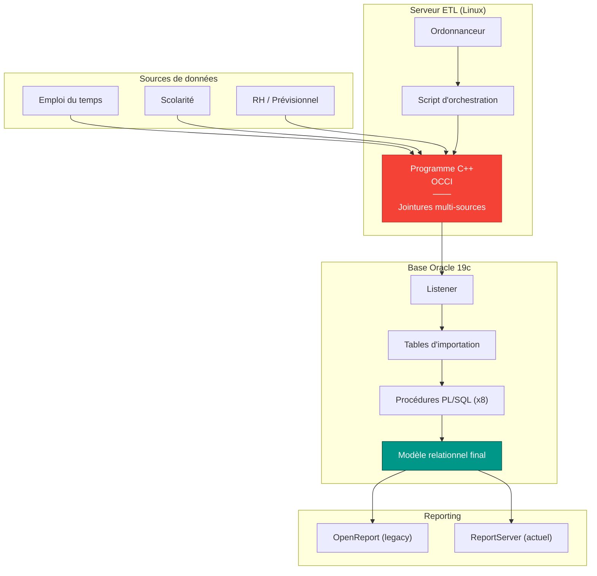
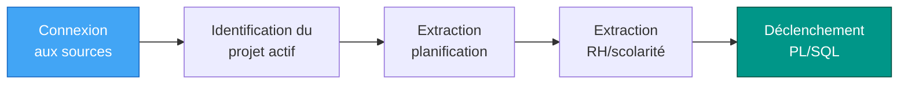

# Programme C++ ETL — Extracteur multi-sources

## Objectif

Programme C++ qui automatise l'extraction et le chargement de données entre plusieurs bases Oracle :
- **Source planification** — données d'emploi du temps
- **Source RH/scolarité** — données enseignants et étudiants
- **Destination** — schéma de statistiques

Le programme gère le cycle complet : connexion aux sources, extraction, chargement dans les tables d'importation, puis déclenchement des procédures PL/SQL de transformation.

---

## Architecture technique

```mermaid
graph TD
    subgraph SOURCES["Sources de données"]
        ADE["Emploi du temps"]
        APO["Scolarité"]
        CKT["RH / Prévisionnel"]
    end

    subgraph ETL["Serveur ETL (Linux)"]
        CRON["Ordonnanceur"]
        WRAP["Script d'orchestration"]
        CPP["Programme C++<br/>OCCI<br/>───<br/>Jointures multi-sources"]
    end

    subgraph ORACLE["Base Oracle 19c"]
        LISTENER["Listener"]
        IMPORT["Tables d'importation"]
        PLSQL["Procédures PL/SQL (x8)"]
        MODEL["Modèle relationnel final"]
    end

    subgraph REPORT["Reporting"]
        OR["OpenReport (legacy)"]
        RS["ReportServer (actuel)"]
    end

    ADE --> CPP
    APO --> CPP
    CKT --> CPP
    CRON --> WRAP
    WRAP --> CPP
    CPP --> LISTENER
    LISTENER --> IMPORT
    IMPORT --> PLSQL
    PLSQL --> MODEL
    MODEL --> OR
    MODEL --> RS

    style CPP fill:#F44336,stroke:#C62828,color:#fff
    style MODEL fill:#009688,stroke:#004D40,color:#fff
```

---

## Composants

| Composant | Rôle |
|---|---|
| Chargeur de configuration | Charge les paramètres de connexion et chemins depuis un fichier de configuration externe |
| Chargeur de requêtes | Charge les scripts SQL externes, remplace les variables dynamiques |
| Suivi de progression | Affichage de l'avancement dans le terminal (processus parent) |
| Journalisation | Horodatage de chaque étape dans un fichier de log |

---

## Mécanismes système

### Multi-processus (fork)

Le programme utilise `fork()` pour séparer :
- **Processus enfant** : exécute les extractions (tâche lourde, I/O Oracle)
- **Processus parent** : affiche la barre de progression

La communication entre les deux passe par un **segment de mémoire partagée** (`shmget` / `shmat`) qui transporte l'état d'avancement.

### Verrouillage d'instance

Utilisation de `flock` sur un fichier PID pour empêcher l'exécution simultanée de plusieurs instances. Ce mécanisme est critique car les procédures PL/SQL en aval ne supportent pas les exécutions concurrentes (opérations de purge et de rechargement sur les mêmes tables).

---

## Commandes

### Extraction et chargement

C'est le cœur du programme. Flux :

```mermaid
graph LR
    C1["Connexion<br/>aux sources"] --> C2["Identification du<br/>projet actif"]
    C2 --> C3["Extraction<br/>planification"]
    C3 --> C4["Extraction<br/>RH/scolarité"]
    C4 --> C5["Déclenchement<br/>PL/SQL"]

    style C1 fill:#42A5F5,stroke:#1565C0,color:#fff
    style C5 fill:#009688,stroke:#004D40,color:#fff
```

1. **Connexion** aux différentes bases sources
2. **Identification du projet actif** (traitement marqué comme activé)
3. **Extractions en cascade** : planification, puis RH/scolarité
4. **Déclenchement** de la procédure PL/SQL maître

### Export secondaire

Fonction secondaire : extraction de permissions utilisateurs pour alimenter un gestionnaire de listes de diffusion externe.

---

## Fichiers SQL requis

Le binaire s'appuie sur des scripts SQL externes chargés à l'exécution, avec des variables de substitution remplacées dynamiquement selon le projet traité.

---

## Gestion des erreurs

- **Exceptions OCCI** : capturées et consignées dans le fichier de log avec le détail de l'erreur Oracle
- **Vérification des privilèges** : messages d'aide spécifiques en cas de droits insuffisants
- **Fichier de verrouillage** : si une instance tourne déjà, le programme refuse de démarrer et log l'information

---

## Compilation et dépendances

Compilé en C++ avec g++, lié aux librairies clientes Oracle OCCI 19c.

> **Point d'attention technique :** le binaire doit être exécuté avec un environnement pointant exclusivement vers les librairies clientes de la version 19c. Un mélange avec d'autres versions provoque des erreurs de connexion intermittentes.
