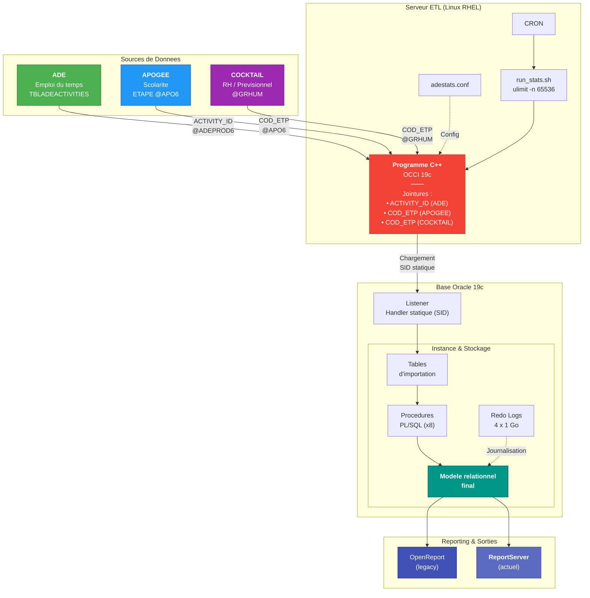

# Programme C++ ETL — Extracteur multi-sources

## Objectif

Programme C++ qui automatise l'extraction et le chargement de données entre 3 bases Oracle :
- **ADE** (source) — données de planification / emplois du temps
- **COCKTAIL** (source) — données RH et étudiants
- **STATS** (destination) — schéma de statistiques

Le programme gère le cycle complet : connexion aux sources, extraction, chargement dans les tables d'importation, puis déclenchement des procédures PL/SQL de transformation.

---

## Architecture technique



---

## Composants

| Composant | Rôle |
|---|---|
| `ConfigLoader` | Charge la configuration depuis `/usr/local/etc/adestats.conf` (identifiants DB, chemins) |
| `sqlString` | Charge les scripts SQL externes, remplace les variables dynamiques (`{{PROJECTID}}`, etc.) |
| `ProgressBar` / `ade_bin_monitor` | Affichage de la progression dans le terminal (processus parent) |
| `log_to_file` | Journalisation horodatée de chaque étape |

---

## Mécanismes système

### Multi-processus (fork)

Le programme utilise `fork()` pour séparer :
- **Processus enfant** : exécute les extractions (tâche lourde, I/O Oracle)
- **Processus parent** : affiche la barre de progression

La communication entre les deux passe par un **segment de mémoire partagée** (`shmget` / `shmat`) qui transporte l'état d'avancement.

### Verrouillage d'instance

Utilisation de `flock` sur un fichier PID pour empêcher l'exécution simultanée de plusieurs instances. Ce mécanisme est critique car les procédures PL/SQL en aval ne supportent pas les exécutions concurrentes (TRUNCATE / INSERT sur les mêmes tables).

---

## Commandes

### `ade stats <n>` — Extraction et chargement

C'est le cœur du programme. Flux :


1. **Connexion** aux 3 bases (ADE, COCKTAIL, STATS)
2. **Identification du projet actif** dans `UHA_ADEPROJECTS` (`EXTRACT_ENABLE = 1`)
3. **Extractions en cascade** :
   - `EXTRACTION_ADE.sql` → `UHA_EXTRACTION_ADE`
   - Caractéristiques, entités, membres des cours
   - `EXTRACTION_COCKTAIL.sql` → `UHA_EXTRACTION_COCKTAIL`
4. **Déclenchement** de la procédure PL/SQL `UHA_ADESTATS(PROJECTID, ADEPROJECTID)`

### `ade exports` — Export pour listes de diffusion

Fonction secondaire :
1. Extrait les permissions utilisateurs depuis ADE
2. Génère un fichier texte (`import-ade-sympa.txt`) pour alimenter le gestionnaire de listes de diffusion (Sympa)

---

## Fichiers SQL requis

Le binaire s'appuie sur des scripts SQL externes chargés à l'exécution :

```
sql/
├── EXTRACTION_ADE.sql              ← Requête d'extraction ADE
├── EXTRACTION_ADE_import.sql       ← Chargement dans tables STATS
├── EXTRACTION_COCKTAIL.sql         ← Requête d'extraction RH
└── ...

scripts/
└── 04-01_ADESTATS_Create_Temp_Tables.sql  ← Initialisation tables temp
```

Les scripts contiennent des variables de substitution (`{{PROJECTID}}`, `{{ADEPROJECTID}}`, `{{SCHEMA}}`) remplacées à la volée par `sqlString`.

---

## Gestion des erreurs

- **Exceptions OCCI** : capturées (`SQLException`) et consignées dans le fichier de log avec le détail Oracle (code erreur, message)
- **Vérification des privilèges** : messages d'aide spécifiques si les droits sur `V$SESSION` / `V$PROCESS` sont insuffisants
- **Fichier PID** : si le verrou existe déjà, le programme refuse de démarrer et log l'information

---

## Compilation et dépendances

| | |
|---|---|
| Compilateur | g++ (version standard RHEL) |
| Librairie Oracle | OCCI 19c (`libocci.so.19.1`, `libclntsh.so.19.1`) |
| ORACLE_HOME | `/opt/oracle/product/19c` |
| Dépendances système | `libnnz19.so`, `libclntshcore.so.19.1` |

> **⚠️ Point critique :** le binaire DOIT être exécuté avec un `LD_LIBRARY_PATH` pointant exclusivement vers les librairies 19c. Un mélange avec d'autres versions (ex: 21c) provoque des erreurs intermittentes. Voir [incident ORA-12516](../incidents/ora-12516-occi.md).
