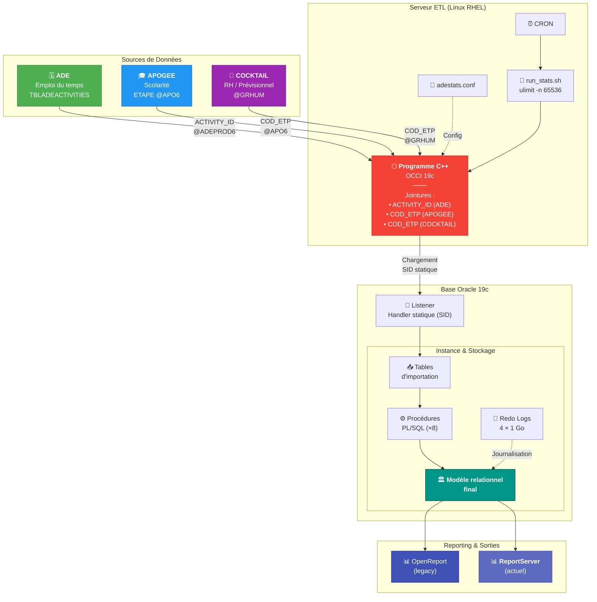
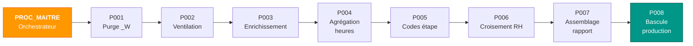
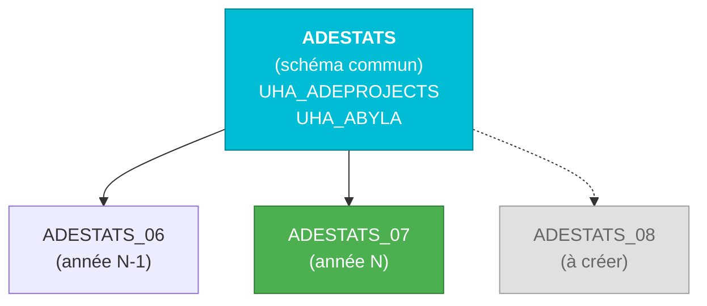

# Architecture ADESTATS

## Flux de données

```mermaid
graph TD
    subgraph SOURCES["Sources de Données"]
        ADE["🗓️ <b>ADE</b><br/>Emploi du temps<br/>TBLADEACTIVITIES"]
        APO["🎓 <b>APOGEE</b><br/>Scolarité<br/>ETAPE @APO6"]
        CKT["👤 <b>COCKTAIL</b><br/>RH / Prévisionnel<br/>@GRHUM"]
    end

    subgraph ETL["Serveur ETL (Linux RHEL)"]
        CRON["⏰ CRON"]
        WRAP["🔧 run_stats.sh<br/>ulimit -n 65536"]
        CONF["📄 adestats.conf"]
        CPP["⬡ <b>Programme C++</b><br/>OCCI 19c<br/>───<br/>Jointures :<br/>• ACTIVITY_ID (ADE)<br/>• COD_ETP (APOGEE)<br/>• COD_ETP (COCKTAIL)"]
    end

    subgraph ORACLE["Base Oracle 19c"]
        LISTENER["🔌 Listener<br/>Handler statique (SID)"]

        subgraph INSTANCE["Instance & Stockage"]
            IMPORT["📥 Tables<br/>d'importation"]
            PLSQL["⚙️ Procédures<br/>PL/SQL (×8)"]
            REDO["💾 Redo Logs<br/>4 × 1 Go"]
            MODEL["🏛️ <b>Modèle relationnel<br/>final</b>"]
        end
    end

    subgraph REPORT["Reporting & Sorties"]
        OR["📊 OpenReport<br/>(legacy)"]
        RS["📊 <b>ReportServer</b><br/>(actuel)"]
    end

    ADE -->|"ACTIVITY_ID<br/>@ADEPROD6"| CPP
    APO -->|"COD_ETP<br/>@APO6"| CPP
    CKT -->|"COD_ETP<br/>@GRHUM"| CPP

    CRON --> WRAP
    CONF -.->|"Config"| CPP
    WRAP --> CPP

    CPP -->|"Chargement<br/>SID statique"| LISTENER
    LISTENER --> IMPORT
    IMPORT --> PLSQL
    PLSQL --> MODEL
    REDO -.->|"Journalisation"| MODEL

    MODEL --> OR
    MODEL --> RS

    style ADE fill:#4CAF50,stroke:#2E7D32,color:#fff
    style APO fill:#2196F3,stroke:#1565C0,color:#fff
    style CKT fill:#9C27B0,stroke:#6A1B9A,color:#fff
    style CPP fill:#F44336,stroke:#C62828,color:#fff
    style MODEL fill:#009688,stroke:#004D40,color:#fff
    style RS fill:#5C6BC0,stroke:#3949AB,color:#fff
    style OR fill:#3F51B5,stroke:#283593,color:#fff
```

## Chaîne PL/SQL

```mermaid
graph LR
    M["<b>PROC_MAITRE</b><br/>Orchestrateur"]
    P1["P001<br/>Purge _W"]
    P2["P002<br/>Ventilation"]
    P3["P003<br/>Enrichissement"]
    P4["P004<br/>Agrégation<br/>heures"]
    P5["P005<br/>Codes étape"]
    P6["P006<br/>Croisement RH"]
    P7["P007<br/>Assemblage<br/>rapport"]
    P8["P008<br/>Bascule<br/>production"]

    M --> P1 --> P2 --> P3 --> P4 --> P5 --> P6 --> P7 --> P8

    style M fill:#FF9800,stroke:#E65100,color:#fff
    style P8 fill:#009688,stroke:#004D40,color:#fff
```

## Schémas annualisés

```mermaid
graph TD
    COMMON["<b>ADESTATS</b><br/>(schéma commun)<br/>UHA_ADEPROJECTS<br/>UHA_ABYLA"]

    S06["ADESTATS_06<br/>(année N-1)"]
    S07["ADESTATS_07<br/>(année N)"]
    S08["ADESTATS_08<br/>(à créer)"]

    COMMON --> S06
    COMMON --> S07
    COMMON -.-> S08

    style COMMON fill:#00BCD4,stroke:#00838F,color:#fff
    style S07 fill:#4CAF50,stroke:#2E7D32,color:#fff
    style S08 fill:#E0E0E0,stroke:#9E9E9E,color:#666
```
